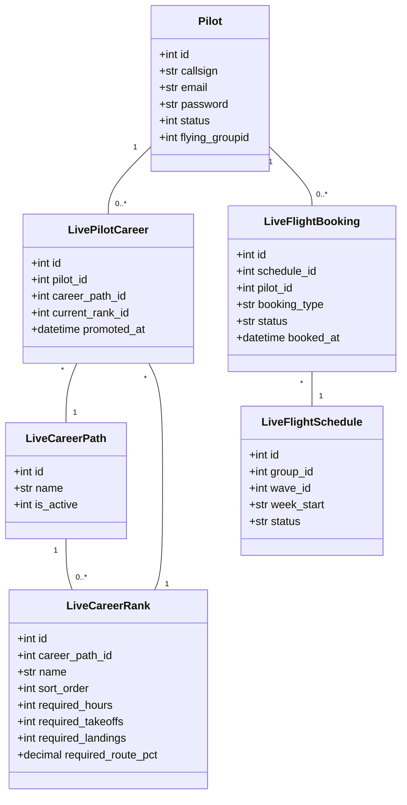

# ✈️ OryxOps Full-Stack Architecture & Career Mode Guide

Welcome to the **OryxOps (QRV Live)** developer guide! This document is designed for developers onboarding onto this project. It provides an in-depth breakdown of the entire virtual airline career management system, database schemas, core services logic, and frontend components.

---

## 📌 System Goal & Overview
OryxOps is a custom-built Virtual Airline (VA) manager for **Qatari Virtual (QRV)** flight simulator pilots. 

Rather than a simple statistics-logger, OryxOps is a **Full Career Simulator** that models:
1. **Career Path Progression**: Tracking pilot rank advancement along specific paths (Airbus vs. Boeing) using flight hours, takeoff/landing counts, and route exploration percentages.
2. **Flight Scheduling & Waves**: Organizes flight rosters into scheduled daily "waves" (time blocks) with capacity and booking guards.
3. **Interactive Booking Engine**: Supports booking flight segments (Departure leg, Arrival leg, or Round-trip) with status controls.
4. **Route Discovery System**: A gamified exploration library where pilots fly compatible aircraft types to "discover" routes, unlocking them for the airline and contributing to rank promotion progress.
5. **Interactive EFB & Audio Co-Pilot**: Hands-free voice-controlled checklists with VHF mic pops and real-time wind projection indicators.

---

## 🏗️ System Architecture

```text
               +--------------------------------------+
               |             React Client             |
               |         (Vite, Tailwind, Redux)      |
               +------------------+-------------------+
                                  |
                        HTTPS (REST API JSON)
                                  |
                                  v
               +--------------------------------------+
               |           FastAPI Backend            |
               |     (Uvicorn, Python, SQLAlchemy)    |
               +------------------+-------------------+
                                  |
                          aiomysql (Async)
                                  v
               +--------------------------------------+
               |           MySQL Database             |
               |    (Pilot, Booking, Schedule Tables) |
               +------------------+-------------------+
```

---

## 📂 Project Directory Layout

```text
OryxOps/
├── backend/                  # FastAPI Python Application
│   ├── app/
│   │   ├── api/              # API Endpoint Routers
│   │   │   ├── endpoints/    # Feature routers (auth, bookings, careers, etc.)
│   │   │   └── router.py     # Central Router Registry
│   │   ├── core/             # Base configurations (database, security, deps)
│   │   ├── models/           # SQLAlchemy Declarative Models (live_models.py)
│   │   ├── schemas/          # Pydantic validation schemas
│   │   ├── services/         # Business logic & Database queries
│   │   └── main.py           # FastAPI server initialization
│   ├── requirements.txt      # Python dependencies
│   └── run.py                # Server execution script
├── frontend/                 # Vite React TypeScript Application
│   ├── src/
│   │   ├── api/              # Fetch HTTP request wrapper (client.ts)
│   │   ├── assets/           # Static data & checklist JSON configurations
│   │   ├── components/       # Reusable components (sidebar, efb modules)
│   │   ├── hooks/            # Custom React hooks
│   │   ├── pages/            # View pages (Dashboard, Admin, Career, Calendar)
│   │   ├── store/            # Redux Toolkit global store slices
│   │   ├── App.tsx           # Router mappings & Auth Initializer
│   │   └── main.tsx          # React ReactDom client entrypoint
│   ├── package.json          # Node dependencies & build scripts
│   └── vite.config.ts        # Vite configuration & dev proxy
├── untracked_token_files/    # Untracked legacy token backup files (ignored)
└── start_app.bat             # Concurrently launches backend & frontend
```

---

## 🗄️ Database Schema & Models (`live_models.py`)
All database tables are mapped asynchronously using SQLAlchemy inside `backend/app/models/live_models.py`.



### ⚠️ Critical Developer Constraint: Pilot Filters
When querying the pilot roster (e.g. `get_pilot_list` in `pilot_service.py`), the system applies an explicit filter:
```python
subquery = select(AwardGranted.pilotid).where(AwardGranted.awardid == 9)
query = query.where(Pilot.id.in_(subquery))
```
> [!WARNING]
> Only pilots who have been granted **Award ID 9** (the `"Oryxops"` award) will appear on rosters, lists, or in the admin panels. If you create a test pilot locally and they do not show up, ensure you insert a record into the `award_granted` table matching this ID.

---

## ⚙️ Backend Services & Business Logic

### 1. Career Progression (`career_service.py`)
Tracks pilot enrollment in paths (such as Airbus or Boeing) and calculates progress toward the next rank.
- **Rank requirements check**:
  - Checks if pilot's flight hours meet the rank threshold.
  - Queries historical PIREPs (`takeoffs` and `landings`) to ensure experience criteria are met.
  - **Discovery Percentage**: Determines the ratio of routes compatible with the rank's aircraft type ratings that the pilot has actually flown and discovered:
    $$\text{Discovery \%} = \frac{\text{Discovered Routes Flown by Pilot}}{\text{Total Routes Mapped to Type}} \times 100$$
  - If all metrics are complete, `can_promote` yields `True`, enabling rank promotion.

### 2. Flight Booking & Leg Availability (`booking_service.py`)
Reservations support segment bookings: `"departure"`, `"arrival"`, or `"both"` (round-trip).
- **Round-Trip Locking**:
  - When booking `"both"`, the system verifies that *neither* the departure leg nor the arrival leg has been booked by other pilots. It then inserts two separate records (one `"departure"` booking, one `"arrival"` booking).
- **Status Lifecycles**:
  - `booked`: Reservation is active.
  - `completed`: Successfully flown and linked to a `completed_pirep_id`.
  - `cancelled`: Frees up the slot.
  - `no_show`: Flags a missed flight, allowing the slot to be reassigned.
  - `reassigned`: Booking taken over by another pilot (`taken_over_by` and `taken_over_at` set).

### 3. Route Discovery Tracker (`discovery_service.py`)
Updates exploration statistics whenever a pilot logs a flight on a new route. This dynamically unlocks routes for compatible aircraft types and contributes to promotion percentages.

---

## 🎛️ Frontend Client Architecture (`frontend/`)

### 1. Centralized Auth Wrapper (`App.tsx`)
Authentication is verified on load via `<AuthInitializer>` which requests `/api/auth/me`.
- **401 vs 403 HTTP Codes**: 
  - To prevent browsers from stripping the `Authorization` header on redirects, the backend handles `/api/auth/me` and `/api/auth/me/` explicitly without redirects.
  - The backend uses `HTTPBearer(auto_error=False)` to catch unauthenticated visitors and return a clean `401 Unauthorized` instead of `403 Forbidden`. The React fetch client (`client.ts`) catches the 401 code, clears local storage, and redirects to `/login`.

### 2. Interactive Voice EFB (`EFBChecklist.tsx`)
The checklist co-pilot utilizes browser Web Speech API elements to automate cockpit checklist callouts.

#### State Machine & Audio Gating:
- **SpeechSynthesis (TTS)**: Calls out the item challenge (e.g. *"Beacon Light"*).
- **Microphone Gating**: The browser microphone is **explicitly disabled** while TTS is active. This prevents the co-pilot from hearing and validating its own readback.
- **Fuzzy Text Matching**: Spoken pilot responses are matched using Jaro-Winkler/Levenshtein similarity. If similarity is $\ge 82\%$, the item validates, triggers a chime, and auto-advances.
- **Web Audio API**: VHF radio clicks (mic pop static) and success chimes are generated using native code oscillators (`OscillatorNode`), avoiding heavy static MP3 assets.

### 3. Weather & Wind Vector Calculator (`EFBWeather.tsx`)
Queries our backend proxy (`/api/efb/weather`) to bypass browser CORS blocks.
- **METAR Decoder**: Parses ceiling altitudes, temperature spreads, altimeters ($hPa \leftrightarrow inHg$), and assigns flight category badges (`VFR`, `IFR`, etc.).
- **Runway Wind Projections**: PROJECTS wind angles onto active runways to calculate tailwind/headwind and crosswind components:
  $$\text{Headwind} = \text{Wind Speed} \times \cos(\text{Wind Angle} - \text{Runway Heading})$$
  $$\text{Crosswind} = \text{Wind Speed} \times \sin(\text{Wind Angle} - \text{Runway Heading})$$

---

## 🛠️ Local Environment Launcher (`start_app.bat`)
To run both backend and frontend environments concurrently:
```batch
@echo off
start "FastAPI Backend" cmd /k "cd /d backend && .\venv\Scripts\python run.py"
start "React Frontend" cmd /k "cd /d frontend && npm run dev"
```

---

## 🚀 Production Deployment Guidelines

### 1. Database Migrations
Ensure the database schema has all column adjustments.
> [!IMPORTANT]
> If the backend user lacks `ALTER` permissions and migrations fail on startup, execute this script manually using your root user:
> ```sql
> ALTER TABLE live_flight_bookings ADD COLUMN booking_type VARCHAR(20) NOT NULL DEFAULT 'both';
> ```

### 2. Frontend Compiled Assets
Frontend static files are compiled into `frontend/dist/` which is ignored by Git.
> [!WARNING]
> Pulling from Git will **not** compile the frontend. You **MUST** run the build compiler on the host to generate the production assets:
> ```bash
> cd frontend
> npm install
> npm run build
> ```
