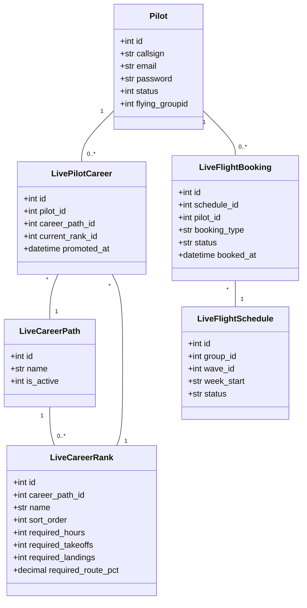

# ✈️ OryxOps Full-Stack Architecture & Career Mode Guide

Welcome to the **OryxOps (QRV Live)** developer guide! This document is designed for developers onboarding onto this project. It provides an in-depth breakdown of the entire virtual airline career management system, database schemas, core services logic, and frontend components.

---

## 📌 System Goal & Overview
OryxOps is a custom-built Virtual Airline (VA) manager for **Qatari Virtual (QRV)** flight simulator pilots. 

Rather than a simple statistics-logger, OryxOps is a **Full Career Simulator** that models:
1. **Career Path Progression**: Tracking pilot rank advancement along specific paths (Airbus vs. Boeing) using flight hours, takeoff/landing counts, and route exploration percentages.
2. **Flight Scheduling & Waves**: Organizes flight rosters into scheduled daily "waves" (time blocks) with capacity and booking guards.
3. **Interactive Booking Engine**: Supports booking flight segments (Departure leg, Arrival leg, or Round-trip) with status controls.
4. **Route Discovery System**: A gamified exploration library where pilots fly compatible aircraft types to "discover" routes, unlocking them for the airline and contributing to rank promotion progress.
5. **Interactive EFB & Audio Co-Pilot**: Hands-free voice-controlled checklists with VHF mic pops and real-time wind projection indicators.

---

## 🏗️ System Architecture

```text
               +--------------------------------------+
               |             React Client             |
               |         (Vite, Tailwind, Redux)      |
               +------------------+-------------------+
                                  |
                        HTTPS (REST API JSON)
                                  |
                                  v
               +--------------------------------------+
               |           FastAPI Backend            |
               |     (Uvicorn, Python, SQLAlchemy)    |
               +------------------+-------------------+
                                  |
                          aiomysql (Async)
                                  v
               +--------------------------------------+
               |           MySQL Database             |
               |    (Pilot, Booking, Schedule Tables) |
               +------------------+-------------------+
```

---

## 📂 Project Directory Layout

```text
OryxOps/
├── backend/                  # FastAPI Python Application
│   ├── app/
│   │   ├── api/              # API Endpoint Routers
│   │   │   ├── endpoints/    # Feature routers (auth, bookings, careers, etc.)
│   │   │   └── router.py     # Central Router Registry
│   │   ├── core/             # Base configurations (database, security, deps)
│   │   ├── models/           # SQLAlchemy Declarative Models (live_models.py)
│   │   ├── schemas/          # Pydantic validation schemas
│   │   ├── services/         # Business logic & Database queries
│   │   └── main.py           # FastAPI server initialization
│   ├── requirements.txt      # Python dependencies
│   └── run.py                # Server execution script
├── frontend/                 # Vite React TypeScript Application
│   ├── src/
│   │   ├── api/              # Fetch HTTP request wrapper (client.ts)
│   │   ├── assets/           # Static data & checklist JSON configurations
│   │   ├── components/       # Reusable components (sidebar, efb modules)
│   │   ├── hooks/            # Custom React hooks
│   │   ├── pages/            # View pages (Dashboard, Admin, Career, Calendar)
│   │   ├── store/            # Redux Toolkit global store slices
│   │   ├── App.tsx           # Router mappings & Auth Initializer
│   │   └── main.tsx          # React ReactDom client entrypoint
│   ├── package.json          # Node dependencies & build scripts
│   └── vite.config.ts        # Vite configuration & dev proxy
├── untracked_token_files/    # Untracked legacy token backup files (ignored)
└── start_app.bat             # Concurrently launches backend & frontend
```

---

## 🗄️ Database Schema & Models (`live_models.py`)
All database tables are mapped asynchronously using SQLAlchemy inside `backend/app/models/live_models.py`.



### ⚠️ Critical Developer Constraint: Pilot Filters
When querying the pilot roster (e.g. `get_pilot_list` in `pilot_service.py`), the system applies an explicit filter:
```python
subquery = select(AwardGranted.pilotid).where(AwardGranted.awardid == 9)
query = query.where(Pilot.id.in_(subquery))
```
> [!WARNING]
> Only pilots who have been granted **Award ID 9** (the `"Oryxops"` award) will appear on rosters, lists, or in the admin panels. If you create a test pilot locally and they do not show up, ensure you insert a record into the `award_granted` table matching this ID.

---

## ⚙️ Backend Services & Business Logic

### 1. Career Progression (`career_service.py`)
Tracks pilot enrollment in paths (such as Airbus or Boeing) and calculates progress toward the next rank.
- **Rank requirements check**:
  - Checks if pilot's flight hours meet the rank threshold.
  - Queries historical PIREPs (`takeoffs` and `landings`) to ensure experience criteria are met.
  - **Discovery Percentage**: Determines the ratio of routes compatible with the rank's aircraft type ratings that the pilot has actually flown and discovered:
    $$\text{Discovery \%} = \frac{\text{Discovered Routes Flown by Pilot}}{\text{Total Routes Mapped to Type}} \times 100$$
  - If all metrics are complete, `can_promote` yields `True`, enabling rank promotion.

### 2. Flight Booking & Leg Availability (`booking_service.py`)
Reservations support segment bookings: `"departure"`, `"arrival"`, or `"both"` (round-trip).
- **Round-Trip Locking**:
  - When booking `"both"`, the system verifies that *neither* the departure leg nor the arrival leg has been booked by other pilots. It then inserts two separate records (one `"departure"` booking, one `"arrival"` booking).
- **Status Lifecycles**:
  - `booked`: Reservation is active.
  - `completed`: Successfully flown and linked to a `completed_pirep_id`.
  - `cancelled`: Frees up the slot.
  - `no_show`: Flags a missed flight, allowing the slot to be reassigned.
  - `reassigned`: Booking taken over by another pilot (`taken_over_by` and `taken_over_at` set).

### 3. Route Discovery Tracker (`discovery_service.py`)
Updates exploration statistics whenever a pilot logs a flight on a new route. This dynamically unlocks routes for compatible aircraft types and contributes to promotion percentages.

---

## 🎛️ Frontend Client Architecture (`frontend/`)

### 1. Centralized Auth Wrapper (`App.tsx`)
Authentication is verified on load via `<AuthInitializer>` which requests `/api/auth/me`.
- **401 vs 403 HTTP Codes**: 
  - To prevent browsers from stripping the `Authorization` header on redirects, the backend handles `/api/auth/me` and `/api/auth/me/` explicitly without redirects.
  - The backend uses `HTTPBearer(auto_error=False)` to catch unauthenticated visitors and return a clean `401 Unauthorized` instead of `403 Forbidden`. The React fetch client (`client.ts`) catches the 401 code, clears local storage, and redirects to `/login`.

### 2. Interactive Voice EFB (`EFBChecklist.tsx`)
The checklist co-pilot utilizes browser Web Speech API elements to automate cockpit checklist callouts.

#### State Machine & Audio Gating:
- **SpeechSynthesis (TTS)**: Calls out the item challenge (e.g. *"Beacon Light"*).
- **Microphone Gating**: The browser microphone is **explicitly disabled** while TTS is active. This prevents the co-pilot from hearing and validating its own readback.
- **Fuzzy Text Matching**: Spoken pilot responses are matched using Jaro-Winkler/Levenshtein similarity. If similarity is $\ge 82\%$, the item validates, triggers a chime, and auto-advances.
- **Web Audio API**: VHF radio clicks (mic pop static) and success chimes are generated using native code oscillators (`OscillatorNode`), avoiding heavy static MP3 assets.

### 3. Weather & Wind Vector Calculator (`EFBWeather.tsx`)
Queries our backend proxy (`/api/efb/weather`) to bypass browser CORS blocks.
- **METAR Decoder**: Parses ceiling altitudes, temperature spreads, altimeters ($hPa \leftrightarrow inHg$), and assigns flight category badges (`VFR`, `IFR`, etc.).
- **Runway Wind Projections**: PROJECTS wind angles onto active runways to calculate tailwind/headwind and crosswind components:
  $$\text{Headwind} = \text{Wind Speed} \times \cos(\text{Wind Angle} - \text{Runway Heading})$$
  $$\text{Crosswind} = \text{Wind Speed} \times \sin(\text{Wind Angle} - \text{Runway Heading})$$

---

## 🛠️ Local Environment Launcher (`start_app.bat`)
To run both backend and frontend environments concurrently:
```batch
@echo off
start "FastAPI Backend" cmd /k "cd /d backend && .\venv\Scripts\python run.py"
start "React Frontend" cmd /k "cd /d frontend && npm run dev"
```

---

## 🚀 Production Deployment Guidelines

### 1. Database Migrations
Ensure the database schema has all column adjustments.
> [!IMPORTANT]
> If the backend user lacks `ALTER` permissions and migrations fail on startup, execute this script manually using your root user:
> ```sql
> ALTER TABLE live_flight_bookings ADD COLUMN booking_type VARCHAR(20) NOT NULL DEFAULT 'both';
> ```

### 2. Frontend Compiled Assets
Frontend static files are compiled into `frontend/dist/` which is ignored by Git.
> [!WARNING]
> Pulling from Git will **not** compile the frontend. You **MUST** run the build compiler on the host to generate the production assets:
> ```bash
> cd frontend
> npm install
> npm run build
> ```

---

## 💰 Flight Economics System

Each time a pilot marks a flight as completed via the EFB Manual Log, the system calculates the flight's financial outcome. All parameters below are **live-configurable** from the database settings.

### Overview of the Calculation Flow

```text
  Pilot submits EFB Log (flight_time_minutes, fuel_burned, landing_fpm, actual_arrival)
                          │
                          ▼
               1. Load rate settings from `live_settings`
               2. Load capacity/operating cost from `aircrafts.json`
                          │
                          ▼
        3. Calculate Gross Passenger Revenue (ticket sales)
        4. Calculate Total Expenses (fuel + landing fee + penalty + operating cost + diversion)
        5. Net Profit = Revenue - Expenses
        6. Calculate Pilot Salary (% share of net profit)
                          │
                          ▼
        Booking saved → PIREP filed → Staff reviews in admin
                          │
                          ▼
        On approval → Salary credited to pilot wallet
```

---

### Step 1 — Gross Passenger Revenue (Ticket Sales)

The aircraft fills its seats dynamically based on route direction and reputation. Each seat generates a base fare plus a duration premium.

$$\text{Seat Revenue} = \text{Base} + (\text{flight\_time\_minutes} \times \text{Duration Rate})$$

$$\text{Gross Passenger Revenue} = \text{Passengers} \times \text{Seat Revenue}$$

| Parameter | Setting Key | Default |
|---|---|---|
| Base ticket price per seat | `econ_ticket_base_price` | `220.0` QAR |
| Per-minute ticket price bonus | `econ_ticket_duration_rate` | `1.20` QAR/min |
| Maximum capacity | Loaded from `aircrafts.json` | Model dependent (e.g. A320 = 180, B77W = 396) |

#### Passenger Load Factor
* **Outbound Flights (Departing OTHH):** Passenger load is based on the airline's average reputation index:
  $$\text{Passengers} = \text{Capacity} \times \frac{\text{Average Reputation}}{100} \times \text{Variance } [0.95, 1.05]$$
* **Inbound Flights (Returning to OTHH):** Inbound flights undergo a **70% to 90% return passenger load reduction**:
  $$\text{Passengers} = \text{Capacity} \times \frac{\text{Last Reputation}}{100} \times \text{Variance } [0.95, 1.05] \times \text{Return Factor } [0.70, 0.90]$$

---

### Step 2 — Expenses

#### 2a. Fuel Cost

$$\text{Fuel Expense} = \text{fuel\_burned (kg)} \times \text{Fuel Price Rate}$$

| Parameter | Setting Key | Default |
|---|---|---|
| Fuel price per kilogram | `econ_fuel_price_rate` | `1.10` QAR/kg |

#### 2b. Airport Landing Fee

Determined by the **destination airport size** using the local `airports.csv` dataset, falling back to manual database overrides if not found in the CSV:

1. **OurAirports CSV Lookup:** Queries the local `backend/app/assets/airports.csv` database to find the airport's matching `type` column value.
2. **Database Override Fallback:** Checks settings (`override_large_airports`, `override_medium_airports`, `override_small_airports`) for comma-separated lists of matching airport ICAOs.

| Airport Class | Condition | Landing Fee | Setting Key |
|---|---|---|---|
| Large Hub | Has `type = "large_airport"` in `airports.csv` OR is in `override_large_airports` list | **7,000 QAR** | `econ_airport_fee_large` |
| Medium Airport | Has `type = "medium_airport"` in `airports.csv` OR is in `override_medium_airports` list | **3,500 QAR** | `econ_airport_fee_medium` |
| Small Airport | Has `type = "small_airport"` (or other types) OR is in `override_small_airports` list OR not found | **1,200 QAR** | `econ_airport_fee_small` |

> **Code location:** `booking_service.py → get_airport_class_and_fee()`

#### 2c. Touchdown Landing Penalty

Every flight assesses a discrete landing penalty based on the landing rate (FPM) on touchdown:

| Touchdown Rate (FPM) | Penalty Fee |
|---|---|
| $\le 100 \text{ FPM}$ | **0 QAR** |
| $\le 200 \text{ FPM}$ | **500 QAR** |
| $\le 300 \text{ FPM}$ | **2,000 QAR** |
| $\le 400 \text{ FPM}$ | **6,000 QAR** |
| $> 400 \text{ FPM}$ | **15,000 QAR** |

#### 2d. Aircraft Operating Cost

Rather than using a flat, hardcoded cost per plane model, the airline calculates the operating overhead dynamically based on the aircraft's size (seating capacity) and the actual passenger load factor:

$$\text{Operating Cost} = (\text{Capacity} \times \text{Fixed Rate}) + (\text{Actual Passengers} \times \text{Service Rate})$$

| Parameter | Setting Key | Default Value |
|---|---|---|
| Fixed seat rate | `econ_fixed_rate_per_seat` | `120.0` QAR |
| Passenger service rate | `econ_service_rate_per_pax` | `60.0` QAR |
| Capacity | Loaded dynamically from `aircrafts.json` | Model dependent (e.g. A320 = 180, B77W = 396) |

#### 2e. Passenger-Based Diversion Charge

Assessed if the pilot diverts and lands at an airport different from the scheduled destination:

$$\text{Diversion Charge} = \text{Actual Passengers} \times \text{Diversion Rate}$$

| Parameter | Setting Key | Default Value |
|---|---|---|
| Diversion rate per passenger | `econ_diversion_charge_per_pax` | `100.0` QAR/pax |

---

### Step 3 — Net Profit

$$\text{Net Profit} = \text{Passenger Revenue} - \text{Total Expenses}$$

$$\text{Total Expenses} = \text{Fuel} + \text{Landing Fee} + \text{Landing Penalty} + \text{Operating Cost} + \text{Diversion Charge}$$

---

### Step 4 — Pilot Salary (Wallet Payout)

Salary is a percentage share of the net profit. The share depends on whether the flight was **solo** or **split** across two pilots.

| Scenario | Share % Setting | Minimum Floor Setting |
|---|---|---|
| Solo pilot (both legs) | `econ_payout_share_solo` (default: **10%**) | `econ_min_payout_solo` (default: **750 QAR**) |
| Split — departure pilot | `econ_payout_share_split` (default: **5%**) | `econ_min_payout_split` (default: **350 QAR**) |
| Split — arrival pilot | `econ_payout_share_split` (default: **5%**) | `econ_min_payout_split` (default: **350 QAR**) |

$$\text{Salary} = \max\left(\text{Minimum Floor},\ \text{Net Profit} \times \text{Share \%}\right)$$

> [!IMPORTANT]
> Salary is only credited **after staff approves the PIREP**. While the booking is `completed` but the PIREP is still pending, the wallet shows an estimated value. Upon staff acceptance, `lazy_check_payouts()` triggers and writes the ledger entry to the pilot's wallet.

---

## 🌟 Reputation Score System

Reputation is an overall flight quality score ranging **0% to 100%** reflecting the pilot's punctuality and landing smoothness.

$$\text{Overall Reputation} = \frac{\text{Punctuality Score} + \text{Landing Score}}{2}$$

> For departure-only legs (split booking), only the **Punctuality Score** is used (no landing data available for that leg).

---

### Punctuality Score

Compares actual flight time against the scheduled block time:

$$\text{Variance} = \lvert \text{actual\_minutes} - \text{scheduled\_minutes} \rvert$$

$$\text{Punctuality} = \begin{cases} 100\% & \text{if Variance} \leq \text{Grace} \\ \max(0,\ 100 - (\text{Variance} - \text{Grace})) & \text{if Variance} > \text{Grace} \end{cases}$$

| Parameter | Setting Key | Default |
|---|---|---|
| Grace period (no penalty window) | `repu_punctuality_grace` | `30` min |

**Reference Table:**

| Variance from Schedule | Punctuality Score |
|---|---|
| 0 – 30 min | **100%** ✅ |
| 50 min | **80%** |
| 80 min | **50%** |
| 130 min+ | **0%** |

---

### Landing Smoothness Score

Based on touchdown vertical rate in FPM:

$$\text{Landing Score} = \begin{cases} 100\% & \text{if FPM} \leq \text{Threshold} \\ \max\!\left(0,\ 100 - \dfrac{\text{FPM} - \text{Threshold}}{\text{Divisor}}\right) & \text{if FPM} > \text{Threshold} \end{cases}$$

| Parameter | Setting Key | Default |
|---|---|---|
| Soft-touch threshold (penalty starts above this) | `repu_smoothness_threshold` | `100` FPM |
| FPM per 1% penalty | `repu_smoothness_divisor` | `4.0` |

**Reference Table:**

| Touchdown FPM | Landing Score |
|---|---|
| ≤ 100 | **100%** 🧈 Butter |
| 200 | **75%** |
| 300 | **50%** |
| 500 | **0%** |

---

## ⚙️ `live_settings` Table — Full Rate Reference

All parameters live in the `live_settings` MySQL table and are loaded on every flight completion — **no server restart required**.

### Economics Parameters (`econ_` prefix)

| `setting_key` | Default | Description |
|---|---|---|
| `econ_ticket_base_price` | `150.0` | Base ticket price per passenger (QAR) |
| `econ_ticket_duration_rate` | `2.00` | Bonus per flight minute per ticket (QAR/min) |
| `econ_fuel_price_rate` | `1.10` | Fuel price per kilogram (QAR/kg) |
| `econ_base_maintenance_fee` | `500.0` | Base maintenance fee per flight (QAR) |
| `econ_hard_landing_threshold` | `150.0` | FPM threshold above which hard-landing penalty applies |
| `econ_hard_landing_multiplier` | `12.0` | Hard-landing penalty multiplier |
| `econ_hard_landing_exponent` | `1.5` | Hard-landing penalty exponent |
| `econ_payout_share_solo` | `0.10` | Solo pilot salary share (10% of net profit) |
| `econ_payout_share_split` | `0.05` | Split pilot salary share each (5% of net profit) |
| `econ_min_payout_solo` | `500.0` | Minimum wallet payout for solo pilot (QAR) |
| `econ_min_payout_split` | `250.0` | Minimum wallet payout per split-leg pilot (QAR) |

### Reputation Parameters (`repu_` prefix)

| `setting_key` | Default | Description |
|---|---|---|
| `repu_punctuality_grace` | `30.0` | Variance grace window in minutes before punctuality drops |
| `repu_smoothness_threshold` | `100.0` | FPM below which landing is considered butter (no penalty) |
| `repu_smoothness_divisor` | `4.0` | FPM per 1% landing score drop (higher = more lenient) |

---

## 🔐 Executive Rate Changer — QRV001 to QRV004

All `econ_` and `repu_` settings are **write-gated** at the API level by pilot callsign. Regular staff and pilots cannot modify these values even if they have admin permissions.

### Who Can Change What?

| Role | `econ_` / `repu_` settings | Other settings (webhook URL etc.) |
|---|---|---|
| **QRV001 – QRV004** (Executives) | ✅ Full access | ✅ Full access |
| Admin / Ops Staff | ❌ Blocked (403) | ✅ Allowed |
| Regular Pilot | ❌ Blocked (403) | ❌ Blocked (403) |

### How Executives Change Rates (Step-by-Step)

1. Log in to the OryxOps web portal with your executive callsign (`QRV001`, `QRV002`, `QRV003`, or `QRV004`).
2. Navigate to **Admin Panel** from the left sidebar.
3. Select the **"Rate Changer"** tab — this tab is **invisible to non-executives**.
4. Three grouped cards display all configurable parameters:
   - **✈️ Leg Economics & Ticket Pricing** — base fare, duration rate, fuel per-kg rate, base maintenance, hard-landing FPM thresholds and multipliers.
   - **🌟 Reputation Score Metrics** — punctuality grace period, landing smoothness threshold, landing divisor.
   - **💵 Salary Payout Percentages & Limits** — solo/split profit share percentages and minimum payout floors.
5. Click any input, edit the number, then **click outside or press Tab**. The value saves instantly via a `PATCH /api/settings/{key}` call.
6. The new rate is live for the **next flight completion** — no restart or deployment needed.

> [!CAUTION]
> Changes are **live immediately** for all new flight completions. Setting fuel rate to `0` will zero out all fuel expenses system-wide. Always double-check values before saving!

### Adding a New Configurable Parameter

To introduce a new rate parameter in the future:

1. **Insert into the database:**
   ```sql
   INSERT INTO live_settings (setting_key, setting_value, description)
   VALUES ('econ_my_new_param', '1.0', 'What this parameter controls');
   ```

2. **Add the hardcoded default fallback** in `get_rate_settings()` inside `booking_service.py`:
   ```python
   defaults = {
       ...
       "econ_my_new_param": 1.0,
   }
   ```

3. **Use it in calculations** by calling `rates["econ_my_new_param"]` after `await get_rate_settings(db)`.

4. It will **automatically appear** in the Rate Changer admin UI under the correct group (Leg Economics or Reputation) — no frontend changes needed.
